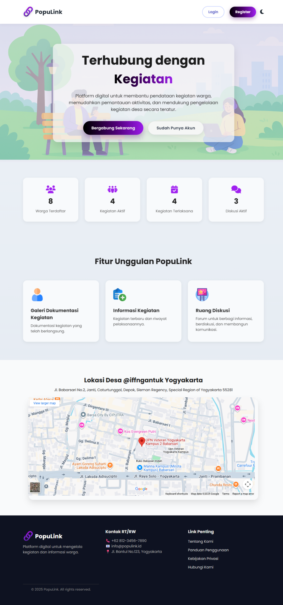
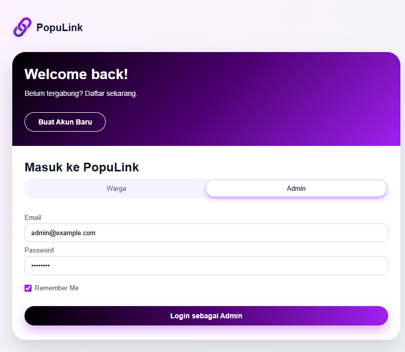
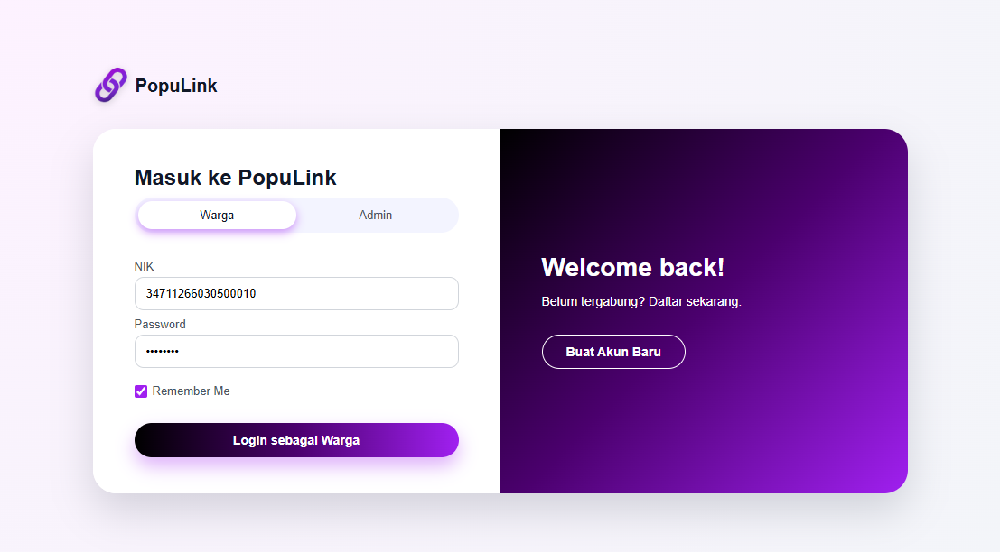
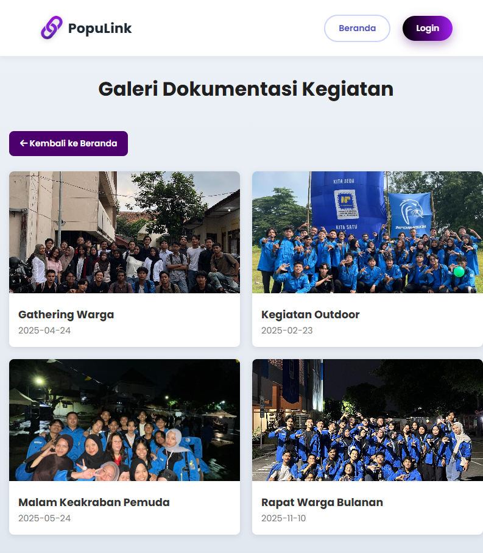
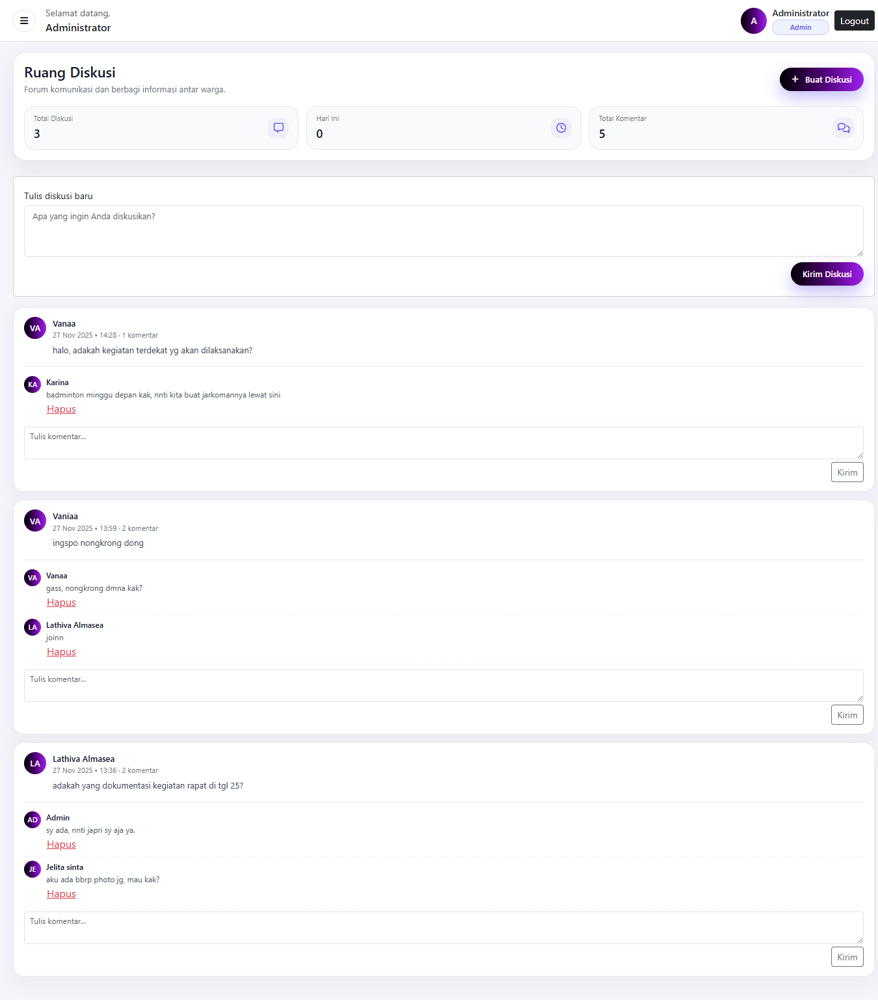
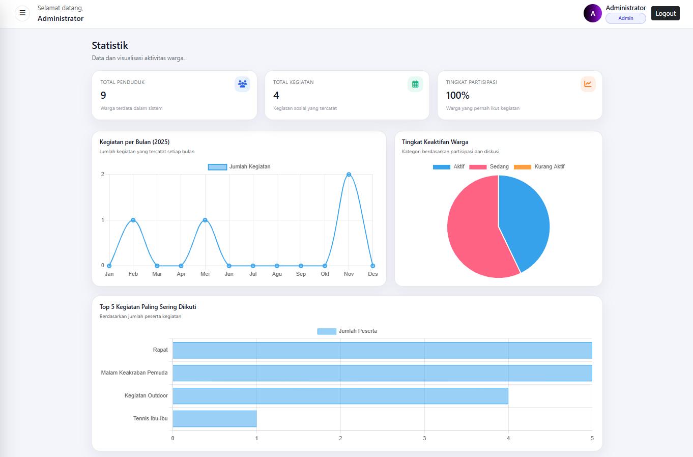

# PopuLink

Aplikasi berbasis web untuk pengelolaan informasi kegiatan warga dan media komunikasi antarwarga.

## Tentang Proyek

PopuLink merupakan aplikasi web yang dirancang untuk membantu warga dalam memperoleh informasi kegiatan, berkomunikasi, serta mengelola data kegiatan dalam satu platform.

Aplikasi memiliki beberapa fitur yang mendukung kebutuhan warga dan admin, seperti pengelolaan kegiatan, galeri dokumentasi, ruang diskusi, dan statistik.

## Fitur

- Halaman publik
- Login dan registrasi
- Dashboard
- Pengelolaan kegiatan
- Galeri dokumentasi
- Informasi kegiatan
- Ruang diskusi
- Statistik
- Profil pengguna
- Role warga dan admin
- CRUD data

## Teknologi

- PHP Native
- MySQL
- HTML
- CSS
- JavaScript
- Bootstrap 5
- Font Awesome
- AOS (Animate On Scroll)

## Struktur Proyek

```text
PopuLink/
├── config/
│   └── koneksi.php
├── features/
│   ├── galeri.php
│   ├── informasi_kegiatan.php
│   └── diskusi.php
├── index.php
├── login.php
├── register.php
├── dashboard.php
├── kegiatan.php
└── statistik.php

```

## Tampilan Aplikasi

### Landing Page



### Login



### Dashboard



### Galeri



### Ruang Diskusi



### Statistik


